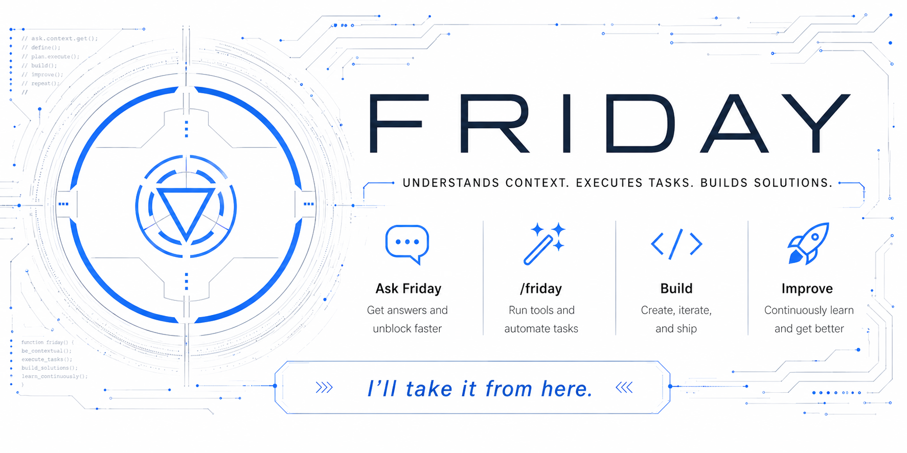
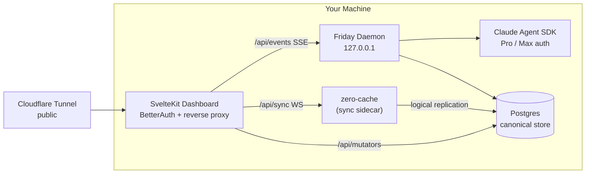

<picture>
  <source media="(prefers-color-scheme: dark)" srcset="images/readme-header-dark.png">
  <source media="(prefers-color-scheme: light)" srcset="images/readme-header-light.png">
  
</picture>

Your local-first AI agent, reachable from anywhere. A headless daemon plus a mobile-first dashboard, glued to Claude Code and exposed publicly via your own Cloudflare Tunnel.

---

## What is Friday?

Friday is a local-first AI orchestrator. A headless Node daemon runs the [Claude Agent SDK](https://docs.anthropic.com/en/docs/claude-code) on your machine. Postgres is the canonical store; Zero (by Rocicorp) is the sync engine that mirrors settled state to each of your devices' local caches so phone, laptop, and tablet all stay in lock-step. A SvelteKit dashboard sits in front of it all as the only public-facing process — auth-gated by BetterAuth, exposed through a Cloudflare Tunnel — and is fully usable from phone, tablet, or laptop.

No servers to deploy beyond your laptop. No third-party identity. Single user, multi-device. One persistent chat with Friday at `/`, and any sub-agents she spawns become first-class chats you can switch into.

**Topology:**



The daemon binds to `127.0.0.1`. zero-cache binds to `127.0.0.1`. The dashboard is the only thing the public internet ever sees, and it gates every request through BetterAuth before forwarding. Daemon and dashboard are peer writers to Postgres — neither owns the DB, each survives the other's reboot.

## Key features

### Chat, anywhere

- **One persistent chat with Friday at `/`.** No conversation list, no "new chat" button — memory and compaction handle long-term context. Sub-agents are first-class chats you switch into via clickable references in the transcript.
- **Mobile-first dashboard.** Priority+ navigation, virtualized lists, PWA install with offline shell, tap-to-insert autocomplete, image and PDF attachments via the native file picker. Fully usable on phone over cellular.
- **Markdown-first rendering.** Streamed responses render with Shiki syntax highlighting (Catppuccin Latte / Mocha) and DOMPurify-hardened output. KaTeX and Mermaid render inline.
- **Local-first sync, live deltas.** Each device runs Zero's reactive cache, so opening Friday on your phone is instant — your chat history, tickets, memory, and unread badges are already there. Settled state flows over a sync WebSocket; live token streaming rides a narrow per-agent SSE side-channel. The connectivity widget honestly distinguishes Internet / Sync / Daemon health.
- **Compaction in place, never session rotation.** As a chat grows, Friday compacts it instead of starting over — a nightly maintenance sweep (03:30 local, orchestrator/helper/bare over 60K context) keeps long-lived agents lean while persona-continuity instructions preserve open commitments, in-flight work, tone, and the reasoning behind recent decisions. Each compaction leaves a durable full-width "Context compacted" divider you can scroll past into pre-compaction history, and a pre-compaction memory flush saves any context that summarization would otherwise lose.

### Multi-agent orchestration

- **Builders, Helpers, Planners, Bare, Scheduled.** The orchestrator (Friday herself) spawns isolated Builder agents in their own git worktrees for project work, short-lived Helpers for delegated tasks, read-only Planners for deep research that ends in a handoff document, Bare agents for ad-hoc `/scratch` sessions, and Scheduled agents for cron / one-shot autonomous work. Builders are confined to their worktree by a PreToolUse workspace guard.
- **Per-role and per-task model selection.** Route each agent role — and each evolve internal pass — to its own Claude model from the settings page, so an Opus planner can design the work while Sonnet builders execute and Haiku handles the scans. Roles without an override fall through to the global default.
- **Mail as the universal delivery primitive.** Every user-visible reply, every cross-agent message, every scheduled-agent escalation flows through the same `mail` table. Priority field on each row; `priority='critical'` mid-turn-injects into a live worker so an interruption actually interrupts.
- **Scheduled agents with state continuity.** Cron and one-shot runs persist `state.md` between fires (auto-injected on the next prompt) and `last-run.md` written by the daemon. Missed runs catch up on restart; cooperative abort on shutdown.
- **User-facing scheduled reminders.** Any agent can set a cron or one-shot reminder (e.g. "thaw the chicken at midday Thursday") that fires straight into your chat as a notification — no worker spawns, no turn, no tokens. The unread badge lights up cross-device; the reminder lands as a `mail`-like chat block without waking the orchestrator.

#### Agent types

**Orchestrator.** Friday herself — the single long-lived agent behind the main chat, and the only role that can spawn anything without stating a reason. She is never archived; compaction and memory keep her one continuous conversation.

**Builder.** Spawned by the orchestrator (only) for project work, each Builder gets an isolated git worktree and a PreToolUse workspace guard that confines writes to it. A Builder lives for the duration of a ticket and is archived when the work ships or is abandoned.

**Helper.** A short-lived delegate for a bounded task — research a question, run a check, draft a document. Any role except a Planner can spawn one with a stated reason, and the spawner owns its archive.

**Planner.** A long-lived deep-research role that designs work but never executes it: read-only on the filesystem, it inherits its parent's working directory, converges on a plan, and mails the parent a handoff document. It is a leaf — it cannot spawn other agents — and its parent archives it once the plan is locked.

**Scheduled.** An autonomous agent fired by cron or a one-shot timer, persisting `state.md` between runs so each fire resumes where the last one left off. No other agent spawns one — the scheduler owns its lifecycle — and missed runs catch up on daemon restart.

**Bare.** A minimal ad-hoc session created by `/scratch`, with a stripped-down prompt stack and the daemon's working directory. It lives until you archive it.

Who can spawn whom:

| Spawner ↓ \ Spawned → | builder             | helper      | bare | planner     | scheduled  |
| --------------------- | ------------------- | ----------- | ---- | ----------- | ---------- |
| orchestrator          | ✅                  | ✅          | ✅   | ✅          | n/a (cron) |
| builder               | ❌                  | ✅ (reason) | ❌   | ✅ (reason) | n/a        |
| helper                | ❌                  | ✅ (reason) | ❌   | ✅ (reason) | n/a        |
| bare                  | ❌                  | ✅ (reason) | ❌   | ✅ (reason) | n/a        |
| scheduled             | 🔒 evolve carve-out | ✅ (reason) | ❌   | ✅ (reason) | n/a        |
| planner               | ❌                  | ❌          | ❌   | ❌          | n/a        |

### Friday Apps

- **Folder-as-app**, one tool call to install. An app at `~/.friday/apps/<id>/` is a manifest plus optional prompt overlays, optional stdio MCP servers, and an optional `.env` for app-scoped secrets. Friday's installer registers the app's agents and schedules, scopes the MCP servers to those agents only, and runs each app's workers with the app folder as `cwd`.
- **Symmetric install / uninstall / reload.** `friday app install <path>`, `friday app uninstall <id>`, `friday app reload <id>`. Default uninstall renames the folder so reinstall un-archives everything; the `--folder=delete` flag is irreversible and prompts unless `--yes`. The orchestrator can do the same through the `friday-apps` MCP server.

### Memory, skills, and self-improvement

- **File-based memory + auto-recall.** Markdown entries with Postgres full-text search (`tsvector` + GIN), recall-frequency boosting, and an audit log. The daemon prepends a `<memory-context>` block at the major dispatch sites (user prompts, mail-driven turns, scheduled fires, scratch, agent spawn) — no `memory_search` tool call required for those paths. A `memory_search` MCP tool is still available for cases that build their own prompts.
- **Slash commands and skills.** Daemon-registered system commands — `/kill`, `/restart`, `/status`, `/inspect`, `/clear`, `/scratch` — are TypeScript-deterministic and instant; `/jump` and `/archive` run client-side. Skills are markdown files in `~/.friday/skills/` (user-additive); the built-in slot at `packages/shared/src/prompts/skills/` is empty in v1.
- **Evolve pipeline.** Scans daemon logs, transcripts, usage, and feedback for friction signals; ranks proposals; surfaces them in the dashboard at `/evolve` for review and apply. The full scan → enrich → cluster → apply loop is being lifted from the old Friday; the store + MCP surface are in place.

### Tickets and integrations

- **System-agnostic tickets** (`FRI-1234`). Comments, relations, and external links live as sibling tables — adding a ticket integration is a new package, not a schema change.
- **Linear integration** (optional). Archiving an agent that owns a Friday ticket propagates the close state (`done` / `canceled` / failure) to the linked Linear issue. Direct ticket edits stay local; cross-system reconcile is read-side. GitHub Issues is on the roadmap.

### Identity that's yours to edit

- **Three-layer prompt stack.** `CONSTITUTION.md` (inviolate, source-only) → `SOUL.md` (your editable identity, copied to `~/.friday/SOUL.md` on first boot, never overwritten on upgrade) → role-specific agent base. Then per-turn: skill context, memory recall, user message.

### Built for the long haul

- **Postgres as canonical store.** Host-installed via Homebrew (`brew install postgresql@18`), Friday provisions a dedicated `friday` database. Daemon and dashboard both write directly — daemon for runtime state (block closes, agent status, mail), dashboard for user-driven mutations via Zero mutators. Each survives the other's reboot. See ADR-023.
- **Row-as-intent dispatch.** Every mutation writes the row it cares about with a status field encoding "side effect needed." The daemon LISTENs on Postgres NOTIFY, dispatches, and transitions the row. Boot recovery scans the same WHERE clauses, so live path and recovery path are the same code. Latency-critical ops (abort, mail-wakeup, cancel-queued) get an additional localhost fast-path; both paths converge on the same idempotent handler.
- **Two-phase bootstrap, generous client cache.** First-time device load fetches the orchestrator's recent chat and active-state metadata in ~2s; background Phase 2 fills the full history for active agents, tickets, memory, and recent mail. Blocks for agents archived >30 days expunge from the client cache; the server keeps everything.
- **Boot recovery.** `~/.claude/projects/.../sessionId.jsonl` is walked once on startup to back-fill any blocks lost between worker `block-complete` and the Postgres write. Idempotent on `(session_id, message_id, kind)` for text/thinking and `(session_id, tool_use_id)` for tool blocks.
- **Continuous invariant auditor.** Every 60s the daemon checks builder-worktree presence and `status=working ⇒ live worker map` against the canonical source. Self-heals quietly; loud only when it has to be.
- **Age-encrypted secrets vault.** Integration secrets in committed `secrets/vault.enc`; machine-local autogen secrets in `.env.local`. `friday secrets` CLI + `friday-secrets` MCP for on-demand fetch (ADR-038).
- **Optional PostHog analytics.** Set `POSTHOG_API_KEY` via `friday secrets set … --daemon` to light up instrumentation across the stack — daemon business + exception events (`posthog-node`) and dashboard product analytics, autocapture, session replay, and client/server error tracking (`posthog-js`). Off by default; silent no-op with no key set. See `docs/setup.md` § Analytics.

## Quick start

### 1. Prerequisites

```bash
brew bundle --file=Brewfile
```

Installs:

- **`postgresql@18`** — Friday's canonical store. Managed by `brew services`, lifecycle-independent of `friday start/stop`.
- **`gh`** — GitHub CLI for Builders to clone and open PRs
- **`fnm`** — Fast Node Manager; resolves the pinned Node from `.node-version` (`22.21.1`) and is how the launchd-supervised stack launches Node, ABI-matched to the pre-baked native modules (ADR-034)
- **`pnpm`** — build/dev-time package manager (CI packs the release tarball, contributors build from source); not on Friday's runtime path
- **`cloudflared`** — Cloudflare Tunnel client (optional, for public reachability)

**Install Claude Code separately** (not in the Brewfile, since the cask shadows Anthropic's own installer):

```bash
# Anthropic's official installer
curl -fsSL https://claude.ai/install.sh | bash
# …or via brew
brew install --cask claude-code
```

See [docs.anthropic.com/en/docs/claude-code](https://docs.anthropic.com/en/docs/claude-code). `friday doctor` verifies `which claude` regardless of install method.

`tmux` is no longer required — Friday's prod supervision moved to launchd, with the plist written directly by the installer (see ADR-028 and ADR-034). Contributors who want it for the dev workflow can `brew install tmux` separately.

Built and tested against Node 22 and pnpm 10. Start Postgres if it isn't already running:

```bash
brew services start postgresql@18
```

> Sign in to Claude Code once before running Friday: `claude` (the CLI walks you through the OAuth flow). Friday's workers spawn the SDK as a child process and inherit that login.

### 2. Install Friday

```bash
curl -fsSL https://raw.githubusercontent.com/sethvoltz/friday/main/install.sh | bash
```

Friday runs on macOS — Apple Silicon (arm64) is the primary target, Intel (x64) is supported as legacy. The installer downloads the **pre-baked release tarball** for your Mac's architecture (no on-device build), verifies its `shasum -a 256`, ensures the pinned Node via `fnm install` (reading `.node-version`), extracts to `~/.local/share/friday/versions/<version>/`, flips the `~/.local/share/friday/current` symlink, drops a `~/.local/bin/friday` shim on your PATH, and writes + bootstraps the launchd plist (`com.sethvoltz.friday`) directly. It finishes in seconds — there's no `pnpm install`/`pnpm -r build` step on your machine. Re-running it updates in place; `friday update` does the same from the CLI (see [CLI](#cli)).

Source-editing contributors who don't want the curl installer can clone + `pnpm install + pnpm build` from the repo — see [Developing Friday](#developing-friday) below. The dev workflow doesn't need the release tarball.

### 3. First-time setup

```bash
friday setup
```

Provisions the `friday` Postgres database and role, runs initial Drizzle migrations, creates `~/.friday/`, copies the default `SOUL.md`, and creates your primary account (email + password). Idempotent — re-run anytime. Use `friday setup --reset-password` to change the password.

### 4. Run

```bash
friday start             # bootstrap/kickstart the launchd job (com.sethvoltz.friday)

friday status            # supervisor + per-service status + probed ports
friday attach daemon     # tail ~/.friday/logs/<service>.jsonl (Ctrl-C exits)
friday logs --follow     # tail the daemon's structured log
```

`friday start` starts the launchd-supervised stack (daemon + dashboard + zero-cache, owned by one supervisor process — ADR-028) by writing + bootstrapping the `com.sethvoltz.friday` launchd job directly (`launchctl bootstrap`/`kickstart`, ADR-034) — no `brew services`. The supervisor's `RunAtLoad: true` means Friday comes back up automatically after Mac reboot/login; you don't have to `friday start` again.

`friday start` prints the local dashboard URL (`http://localhost:7615`) on launch — open it and sign in.

For dev hot-reload, use the `pnpm dev:*` wrappers — see [Developing Friday](#developing-friday).

### 5. (Optional) Public access via Cloudflare Tunnel

```bash
friday setup --cloudflare    # paste connector token + public URL
friday start                  # daemon + dashboard + tunnel
```

`friday setup --cloudflare` installs cloudflared as its own user launch agent (`com.cloudflare.cloudflared`) — it self-starts at login and survives reboots independently of Friday's stack. If `cloudflared` is missing or no token is set, the tunnel is skipped — daemon and dashboard come up regardless. See [docs/setup.md](docs/setup.md) for the full Cloudflare walkthrough.

## CLI

The `friday` CLI manages services and inspects state. Inspection commands work read-only against Postgres directly when the daemon is down.

```bash
# Lifecycle
friday setup [--cloudflare] [--reset-password]
friday doctor                                  # data dir, db, account, external CLIs
friday start                                   # bootstrap/kickstart the launchd job (whole stack atomically)
friday stop                                    # bootout the launchd job (cascade-stops every child)
friday restart                                 # launchctl kickstart -k the launchd job
friday status                                  # supervisor + service state + probed ports
friday attach <daemon|dashboard|zero-cache>    # `tail -F ~/.friday/logs/<service>.jsonl`
friday logs [daemon|dashboard|zero-cache|tunnel] [--follow]

# Install lifecycle (ADR-034)
friday update [--check] [--rollback]           # download + verify + extract latest; flip current symlink; kickstart
friday uninstall [--data=keep|delete] [--yes]  # remove the install tree + launchd job; ~/.friday preserved by default

# Inspection (read-only; daemon optional)
friday agents ls
friday sessions ls
friday memory ls | show <id>
friday tickets ls | show <id>
friday mail inbox <agent>
friday schedules ls

# Mutations (daemon required)
friday agents archive <name>                   # builders: also drops worktree + branch
friday tickets create  --title ... --body ...
friday tickets update <id> --status ...
friday tickets comment <id> --author ... --body ...
friday mail send --from ... --to ... --type ... --body ...
friday schedules <create|pause|resume|trigger|delete> ...

# Memory / Evolve
friday memory <ls|show|add|edit|delete>
friday evolve <list|show|scan|enrich|cluster|apply|dismiss>

# Friday Apps (ADR-021)
friday app install <path> [--adopt]
friday app uninstall <id> [--folder=archive|keep|delete] [--yes]
friday app list | inspect <id> | reload <id>

# Secrets vault (ADR-038)
friday secrets init | unlock --check
friday secrets set <name> [--app <id>] [--mode env|on-demand] [--daemon] [--agents a,b]
friday secrets get|list|unset|edit|audit|migrate-from-env|public-key

# Backup & restore
friday backup [output-path] [--include-age-key]  # pg_dump + filesystem → portable .tar.gz
friday restore <bundle> [--force]              # auto-detects pg_dump vs legacy_sqlite bundles
friday export-legacy-sqlite [output] [--source <path>]
                                               # one-shot SQLite → Postgres cutover bundle
```

See `docs/setup.md` §8 for the routine backup/restore flow and the one-time SQLite → Postgres cutover procedure.

## Project structure

```
agent-friday/
├── packages/
│   ├── shared/             @friday/shared — types, config, logger, DB (Drizzle),
│   │                       wire schema, prompts, services, markdown plugins
│   ├── cli/                @friday/cli   — citty + clack + picocolors
│   ├── memory/             @friday/memory — file store + tsvector FTS + auto-recall
│   ├── evolve/             @friday/evolve — self-improvement pipeline
│   └── integrations/
│       └── linear/         @friday/integrations-linear (optional)
├── services/
│   ├── daemon/             @friday/daemon — owns Claude SDK, agent registry,
│   │                       MCP servers, EventBus, SSE, scheduler, watchdog
│   └── dashboard/          @friday/dashboard — SvelteKit + Svelte 5 (runes),
│                           BetterAuth, adapter-node, PWA
├── bin/                    friday + friday-supervisor shims — exec through fnm (ADR-034)
├── packaging/              pack.mjs — builds the pre-baked release tarball (ADR-034)
├── install.sh              Curl-installable installer (ADR-034)
├── .node-version           Pinned Node (22.21.1) — single Node-pin source of truth
└── docs/                   Architecture, setup, ADRs, sandbox, UX, roadmap
```

Operational files live at `~/.friday/`. Canonical state (blocks, mail, tickets, agents, memory entries, schedules, apps, sessions/users, etc.) lives in the **Postgres `friday` database**, host-managed by `brew services`.

```
~/.friday/
├── config.json, .env, SOUL.md     Settings + secrets + identity
├── agents/<name>/                 Per-agent home (orchestrator/helper/scheduled cwd; ADR-029)
├── apps/<id>/                     Installed Friday Apps (ADR-021)
├── workspaces/<name>/             Builder git worktrees
└── logs/*.jsonl                   Structured logs, rotated at 1 MiB
```

Full layout reference: [docs/running.md#data-location](docs/running.md#data-location).

Override the location with `FRIDAY_DATA_DIR=$HOME/.friday-v2`. Backups: `pg_dump friday > friday.dump.sql` for canonical state; `cp -r ~/.friday somewhere` for operational files.

## Developing

**Stack:** TypeScript (ESM), pnpm workspaces, Turborepo, Vitest, SvelteKit + Svelte 5 runes, BetterAuth, Drizzle ORM (Postgres), Zero (Rocicorp) for client sync, Claude Agent SDK.

### Setup

```bash
pnpm install
pnpm build          # Turborepo: shared first, then services in parallel
```

`@friday/shared` is consumed via its built `dist/`. When you edit shared source, rebuild it before exercising the change downstream:

```bash
pnpm --filter @friday/shared build
```

### Developing Friday

Dev mode runs directly from the repo with two pnpm scripts — **not** the `friday` CLI:

```bash
pnpm dev:daemon       # tsx watch on the daemon — binds :7444
pnpm dev:dashboard    # vite dev on the dashboard — binds :5173
```

Both wrappers set `FRIDAY_DAEMON_PORT=7444` so the dev dashboard's SvelteKit server-side fetches reach the dev daemon (`:7444`) rather than the prod daemon (`:7610`). Prod (`friday start`) and dev (`pnpm dev:*`) can run side-by-side without TCP collisions — prod uses `:7610` / `:7615`, dev uses `:7444` / `:5173`. They share `~/.friday/` (and the prod Postgres `friday` DB + zero-cache) by default; for full isolation, prefix with `FRIDAY_DATA_DIR=$HOME/.friday-dev`. See `docs/running.md` for the parallel-Postgres + parallel-zero-cache caveat.

The `--dev` CLI flag was retired (FRI-83) — `friday start --dev` now exits with citty's unknown-flag error.

### Testing

```bash
pnpm test                                                   # unit suite (fast — no subprocesses)
pnpm test:e2e                                               # multi-subprocess e2e (daemon + dashboard + zero-cache against a scratch PG)
pnpm test:playwright                                        # browser-driven user-visible round-trip (slowest; chromium must be installed)
pnpm --filter @friday/daemon run test                       # one package
pnpm --filter @friday/daemon exec vitest run src/foo.test.ts  # one file
```

Tests are co-located with source as `*.test.ts`, deterministic, no network. Files named `*.e2e.test.ts` are the heavy multi-subprocess suites — excluded from `pnpm test`, run via `pnpm test:e2e`. The Playwright browser suite lives in `services/dashboard/e2e/`. See [docs/architecture.md](docs/architecture.md) for testing conventions.

### Schema migrations

```bash
pnpm drizzle:generate    # after editing packages/shared/src/db/schema.ts
```

The daemon applies pending migrations on boot.

### Health check

```bash
friday doctor
```

Verifies the data dir, config, db migrations, account presence, external CLIs, and (when configured) tunnel state.

## Documentation

| Doc                                              | What's in it                                                                                                       |
| ------------------------------------------------ | ------------------------------------------------------------------------------------------------------------------ |
| [docs/architecture.md](docs/architecture.md)     | System overview, topology, prompt stack, block model, wire protocol, agent lifecycle                               |
| [docs/chat-ux.md](docs/chat-ux.md)               | Single-chat UX, sidebar, focus model, slash commands, attachments, markdown                                        |
| [docs/mobile-ux.md](docs/mobile-ux.md)           | Priority+ nav, virtualization, PWA, mobile autocomplete                                                            |
| [docs/mcp.md](docs/mcp.md)                       | MCP server surface (Friday-internal + user-configured)                                                             |
| [docs/sandbox.md](docs/sandbox.md)               | Worker isolation: M1–M5 rollout (PreToolUse rules, sandbox-exec, pgrp containment, stall watchdog) + residual risk |
| [docs/decisions.md](docs/decisions.md)           | Architecture Decision Records (ADRs) + watch list                                                                  |
| [docs/roadmap.md](docs/roadmap.md)               | Open work, sequenced for execution                                                                                 |
| [docs/setup.md](docs/setup.md)                   | Full setup including Cloudflare Tunnel walkthrough                                                                 |
| [docs/running.md](docs/running.md)               | Daily commands, modes, data layout, cutover from old Friday                                                        |
| [docs/ui-conventions.md](docs/ui-conventions.md) | Cross-cutting UI patterns and icon map                                                                             |
