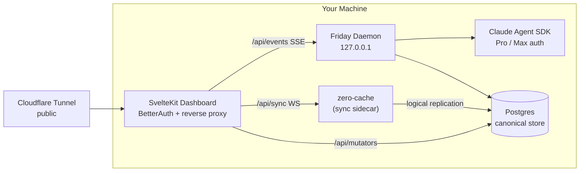

<picture>
  <source media="(prefers-color-scheme: dark)" srcset="images/readme-header-dark.png">
  <source media="(prefers-color-scheme: light)" srcset="images/readme-header-light.png">
  
</picture>

Your local-first AI agent, reachable from anywhere. A headless daemon plus a mobile-first dashboard, glued to Claude Code and exposed publicly via your own Cloudflare Tunnel.

---

## What is Friday?

Friday is a local-first AI orchestrator. A headless Node daemon runs the [Claude Agent SDK](https://docs.anthropic.com/en/docs/claude-code) on your machine. Postgres is the canonical store; Zero (by Rocicorp) is the sync engine that mirrors settled state to each of your devices' local caches so phone, laptop, and tablet all stay in lock-step. A SvelteKit dashboard sits in front of it all as the only public-facing process — auth-gated by BetterAuth, exposed through a Cloudflare Tunnel — and is fully usable from phone, tablet, or laptop.

No servers to deploy beyond your laptop. No third-party identity. Single user, multi-device. One persistent chat with Friday at `/`, and any sub-agents she spawns become first-class chats you can switch into.

**Topology:**



The daemon binds to `127.0.0.1`. zero-cache binds to `127.0.0.1`. The dashboard is the only thing the public internet ever sees, and it gates every request through BetterAuth before forwarding. Daemon and dashboard are peer writers to Postgres — neither owns the DB, each survives the other's reboot.

## Key features

### Chat, anywhere

- **One persistent chat with Friday at `/`.** No conversation list, no "new chat" button — memory and compaction handle long-term context. Sub-agents are first-class chats you switch into via clickable references in the transcript.
- **Mobile-first dashboard.** Priority+ navigation, virtualized lists, PWA install with offline shell, tap-to-insert autocomplete, image and PDF attachments via the native file picker. Fully usable on phone over cellular.
- **Markdown-first rendering.** Streamed responses render with Shiki syntax highlighting (Catppuccin Latte / Mocha) and DOMPurify-hardened output. KaTeX and Mermaid render inline.
- **Local-first sync, live deltas.** Each device runs Zero's reactive cache, so opening Friday on your phone is instant — your chat history, tickets, memory, and unread badges are already there. Settled state flows over a sync WebSocket; live token streaming rides a narrow per-agent SSE side-channel. The connectivity widget honestly distinguishes Internet / Sync / Daemon health.

### Multi-agent orchestration

- **Builders, Helpers, Bare, Scheduled.** The orchestrator (Friday herself) spawns isolated Builder agents in their own git worktrees for project work, short-lived Helpers for delegated tasks, Bare agents for ad-hoc `/scratch` sessions, and Scheduled agents for cron / one-shot autonomous work. Builders are confined to their worktree by a PreToolUse workspace guard.
- **Mail as the universal delivery primitive.** Every user-visible reply, every cross-agent message, every scheduled-agent escalation flows through the same `mail` table. Priority field on each row; `priority='critical'` mid-turn-injects into a live worker so an interruption actually interrupts.
- **Scheduled agents with state continuity.** Cron and one-shot runs persist `state.md` between fires (auto-injected on the next prompt) and `last-run.md` written by the daemon. Missed runs catch up on restart; cooperative abort on shutdown.

### Friday Apps

- **Folder-as-app**, one tool call to install. An app at `~/.friday/apps/<id>/` is a manifest plus optional prompt overlays, optional stdio MCP servers, and an optional `.env` for app-scoped secrets. Friday's installer registers the app's agents and schedules, scopes the MCP servers to those agents only, and runs each app's workers with the app folder as `cwd`.
- **Symmetric install / uninstall / reload.** `friday app install <path>`, `friday app uninstall <id>`, `friday app reload <id>`. Default uninstall renames the folder so reinstall un-archives everything; the `--folder=delete` flag is irreversible and prompts unless `--yes`. The orchestrator can do the same through the `friday-apps` MCP server.

### Memory, skills, and self-improvement

- **File-based memory + auto-recall.** Markdown entries with Postgres full-text search (`tsvector` + GIN), recall-frequency boosting, and an audit log. The daemon prepends a `<memory-context>` block at the major dispatch sites (user prompts, mail-driven turns, scheduled fires, scratch, agent spawn) — no `memory_search` tool call required for those paths. A `memory_search` MCP tool is still available for cases that build their own prompts.
- **Slash commands and skills.** Daemon-registered system commands — `/kill`, `/restart`, `/status`, `/inspect`, `/reset-context`, `/scratch` — are TypeScript-deterministic and instant; `/jump` and `/archive` run client-side. Skills are markdown files in `~/.friday/skills/` (user-additive); the built-in slot at `packages/shared/src/prompts/skills/` is empty in v1.
- **Evolve pipeline.** Scans daemon logs, transcripts, usage, and feedback for friction signals; ranks proposals; surfaces them in the dashboard at `/evolve` for review and apply. The full scan → enrich → cluster → apply loop is being lifted from the old Friday; the store + MCP surface are in place.

### Tickets and integrations

- **System-agnostic tickets** (`FRI-1234`). Comments, relations, and external links live as sibling tables — adding a ticket integration is a new package, not a schema change.
- **Linear integration** (optional). Archiving an agent that owns a Friday ticket propagates the close state (`done` / `canceled` / failure) to the linked Linear issue. Direct ticket edits stay local; cross-system reconcile is read-side. GitHub Issues is on the roadmap.

### Identity that's yours to edit

- **Three-layer prompt stack.** `CONSTITUTION.md` (inviolate, source-only) → `SOUL.md` (your editable identity, copied to `~/.friday/SOUL.md` on first boot, never overwritten on upgrade) → role-specific agent base. Then per-turn: skill context, memory recall, user message.

### Built for the long haul

- **Postgres as canonical store.** Host-installed via Homebrew (`brew install postgresql@18`), Friday provisions a dedicated `friday` database. Daemon and dashboard both write directly — daemon for runtime state (block closes, agent status, mail), dashboard for user-driven mutations via Zero mutators. Each survives the other's reboot. See ADR-023.
- **Row-as-intent dispatch.** Every mutation writes the row it cares about with a status field encoding "side effect needed." The daemon LISTENs on Postgres NOTIFY, dispatches, and transitions the row. Boot recovery scans the same WHERE clauses, so live path and recovery path are the same code. Latency-critical ops (abort, mail-wakeup, cancel-queued) get an additional localhost fast-path; both paths converge on the same idempotent handler.
- **Two-phase bootstrap, generous client cache.** First-time device load fetches the orchestrator's recent chat and active-state metadata in ~2s; background Phase 2 fills the full history for active agents, tickets, memory, and recent mail. Blocks for agents archived >30 days expunge from the client cache; the server keeps everything.
- **Boot recovery.** `~/.claude/projects/.../sessionId.jsonl` is walked once on startup to back-fill any blocks lost between worker `block-complete` and the Postgres write. Idempotent on `(session_id, message_id, kind)` for text/thinking and `(session_id, tool_use_id)` for tool blocks.
- **Continuous invariant auditor.** Every 60s the daemon checks builder-worktree presence and `status=working ⇒ live worker map` against the canonical source. Self-heals quietly; loud only when it has to be.

## Quick start

### 1. Prerequisites

```bash
brew bundle --file=Brewfile
```

Installs:

- **`postgresql@18`** — Friday's canonical store. Managed by `brew services`, lifecycle-independent of `friday start/stop`.
- **`claude-code`** — Claude Code CLI; runs the Agent SDK against the Pro/Max subscription tied to your interactive `claude` login (no `ANTHROPIC_API_KEY` needed once signed in)
- **`gh`** — GitHub CLI for Builders to clone and open PRs
- **`tmux`** — daemon + dashboard + zero-cache supervision
- **`cloudflared`** — Cloudflare Tunnel client (optional, for public reachability)

Built and tested against Node 22 and pnpm 10. Start Postgres if it isn't already running:

```bash
brew services start postgresql@18
```

> Sign in to Claude Code once before running Friday: `claude` (the CLI walks you through the OAuth flow). Friday's workers spawn the SDK as a child process and inherit that login.

### 2. Install and build

```bash
pnpm install
pnpm build
```

### 3. First-time setup

```bash
friday setup
```

Creates `~/.friday/`, provisions the `friday` Postgres database and role, runs initial Drizzle migrations, copies the default `SOUL.md`, and creates your primary account (email + password). Idempotent — re-run anytime. Use `friday setup --reset-password` to change the password.

### 4. Run

```bash
friday start            # production (requires `pnpm build`)
friday start --dev      # tsx watch + vite dev, in tmux

friday status                    # pids, ports, uptime
friday attach daemon             # attach a service's tmux pane (daemon | dashboard)
friday logs --follow             # tail daemon log
```

`friday start` prints the local dashboard URL on launch — open it and sign in.

> **Tip:** add `./bin` to your `PATH` to call `friday` from anywhere, or invoke `./bin/friday` from the repo root during development.

### 5. (Optional) Public access via Cloudflare Tunnel

```bash
friday setup --cloudflare    # paste connector token + public URL
friday start                  # daemon + dashboard + tunnel
```

`friday start` brings the tunnel up automatically when a token is present and tears it down on stop. If `cloudflared` is missing or no token is set, the tunnel is skipped — daemon and dashboard come up regardless. See [docs/setup.md](docs/setup.md) for the full Cloudflare walkthrough.

## CLI

The `friday` CLI manages services and inspects state. Inspection commands work read-only against Postgres directly when the daemon is down.

```bash
# Lifecycle
friday setup [--cloudflare] [--reset-password]
friday doctor                                  # data dir, db, account, external CLIs
friday start [--dev]                           # daemon + dashboard (+ tunnel if configured)
friday stop                                    # tear down the tmux session
friday restart <daemon|dashboard|tunnel|all>   # mode-preserving restart
friday status                                  # pids, ports, uptime, public URL
friday attach <daemon|dashboard>               # attach the tmux pane (service arg required)
friday logs [daemon|dashboard|tunnel] [--follow]

# Inspection (read-only; daemon optional)
friday agents ls
friday sessions ls
friday memory ls | show <id>
friday tickets ls | show <id>
friday mail inbox <agent>
friday schedules ls

# Mutations (daemon required)
friday agents archive <name>                   # builders: also drops worktree + branch
friday tickets create  --title ... --body ...
friday tickets update <id> --status ...
friday tickets comment <id> --author ... --body ...
friday mail send --from ... --to ... --type ... --body ...
friday schedules <create|pause|resume|trigger|delete> ...

# Memory / Evolve
friday memory <ls|show|add|edit|delete>
friday evolve <list|show|scan|enrich|cluster|apply|dismiss>

# Friday Apps (ADR-021)
friday app install <path> [--adopt]
friday app uninstall <id> [--folder=archive|keep|delete] [--yes]
friday app list | inspect <id> | reload <id>

# Backup & restore
friday backup [output-path]                    # pg_dump + filesystem → portable .tar.gz
friday restore <bundle> [--force]              # auto-detects pg_dump vs legacy_sqlite bundles
friday export-legacy-sqlite [output] [--source <path>]
                                               # one-shot SQLite → Postgres cutover bundle
```

See `docs/setup.md` §8 for the routine backup/restore flow and the one-time SQLite → Postgres cutover procedure.

## Project structure

```
agent-friday/
├── packages/
│   ├── shared/             @friday/shared — types, config, logger, DB (Drizzle),
│   │                       wire schema, prompts, services, markdown plugins
│   ├── cli/                @friday/cli   — citty + clack + picocolors
│   ├── memory/             @friday/memory — file store + tsvector FTS + auto-recall
│   ├── evolve/             @friday/evolve — self-improvement pipeline
│   └── integrations/
│       └── linear/         @friday/integrations-linear (optional)
├── services/
│   ├── daemon/             @friday/daemon — owns Claude SDK, agent registry,
│   │                       MCP servers, EventBus, SSE, scheduler, watchdog
│   └── dashboard/          @friday/dashboard — SvelteKit + Svelte 5 (runes),
│                           BetterAuth, adapter-node, PWA
├── bin/                    Dev shim — invokes packages/cli/dist/index.js
└── docs/                   Architecture, setup, ADRs, schema, UX, roadmap
```

Operational files live at `~/.friday/`. Canonical state (blocks, mail, tickets, agents, memory entries, schedules, apps, sessions/users, etc.) lives in the **Postgres `friday` database**, host-managed by `brew services`.

```
~/.friday/
├── config.json             Settings + MCP server config
├── .env                    Secrets (LINEAR_API_KEY, BETTER_AUTH_SECRET, DB url, ...)
├── SOUL.md                 Your editable identity layer
├── skills/*.md             User-additive slash skills
├── memory/entries/*.md     Memory entry bodies (indexed in Postgres)
├── evolve/proposals/*.md   Evolve proposal bodies
├── apps/<id>/              Installed Friday Apps (manifest, prompt, state/, .env)
├── schedules/<name>/       state.md + last-run.md continuity
├── workspaces/<name>/      Builder git worktrees
├── uploads/<sha-bucket>/   Content-addressed attachment bytes
├── logs/*.jsonl            Rotated at 1 MiB (daemon, dashboard, zero-cache)
├── usage.jsonl             Per-turn usage records
└── health.json             Daemon heartbeat (30s)
```

Override the location with `FRIDAY_DATA_DIR=$HOME/.friday-v2`. Backups: `pg_dump friday > friday.dump.sql` for canonical state; `cp -r ~/.friday somewhere` for operational files.

## Developing

**Stack:** TypeScript (ESM), pnpm workspaces, Turborepo, Vitest, SvelteKit + Svelte 5 runes, BetterAuth, Drizzle ORM (Postgres), Zero (Rocicorp) for client sync, Claude Agent SDK.

### Setup

```bash
pnpm install
pnpm build          # Turborepo: shared first, then services in parallel
```

`@friday/shared` is consumed via its built `dist/`. When you edit shared source, rebuild it before exercising the change downstream:

```bash
pnpm --filter @friday/shared build
```

### Dev mode

```bash
friday start --dev               # daemon + dashboard with hot reload in tmux
friday attach dashboard          # attach the dashboard pane (Ctrl-b d to detach)
friday logs daemon --follow      # tail daemon logs without attaching
```

### Testing

```bash
pnpm test                                                   # unit suite (fast — no subprocesses)
pnpm test:e2e                                               # multi-subprocess e2e (daemon + dashboard + zero-cache against a scratch PG)
pnpm test:playwright                                        # browser-driven user-visible round-trip (slowest; chromium must be installed)
pnpm --filter @friday/daemon run test                       # one package
pnpm --filter @friday/daemon exec vitest run src/foo.test.ts  # one file
```

Tests are co-located with source as `*.test.ts`, deterministic, no network. Files named `*.e2e.test.ts` are the heavy multi-subprocess suites — excluded from `pnpm test`, run via `pnpm test:e2e`. The Playwright browser suite lives in `services/dashboard/e2e/`. See [docs/architecture.md](docs/architecture.md) for testing conventions.

### Schema migrations

```bash
pnpm drizzle:generate    # after editing packages/shared/src/db/schema.ts
```

The daemon applies pending migrations on boot.

### Health check

```bash
friday doctor
```

Verifies the data dir, config, db migrations, account presence, external CLIs, and (when configured) tunnel state.

## Documentation

| Doc | What's in it |
|---|---|
| [docs/architecture.md](docs/architecture.md) | System overview, topology, prompt stack, block model, wire protocol, agent lifecycle |
| [docs/chat-ux.md](docs/chat-ux.md) | Single-chat UX, sidebar, focus model, slash commands, attachments, markdown |
| [docs/mobile-ux.md](docs/mobile-ux.md) | Priority+ nav, virtualization, PWA, mobile autocomplete |
| [docs/mcp.md](docs/mcp.md) | MCP server surface (Friday-internal + user-configured) |
| [docs/schema.md](docs/schema.md) | Postgres schema reference |
| [docs/decisions.md](docs/decisions.md) | Architecture Decision Records (ADRs) + watch list |
| [docs/roadmap.md](docs/roadmap.md) | Open work, sequenced for execution |
| [docs/setup.md](docs/setup.md) | Full setup including Cloudflare Tunnel walkthrough |
| [docs/running.md](docs/running.md) | Daily commands, modes, data layout, cutover from old Friday |
| [docs/ui-conventions.md](docs/ui-conventions.md) | Cross-cutting UI patterns and icon map |
